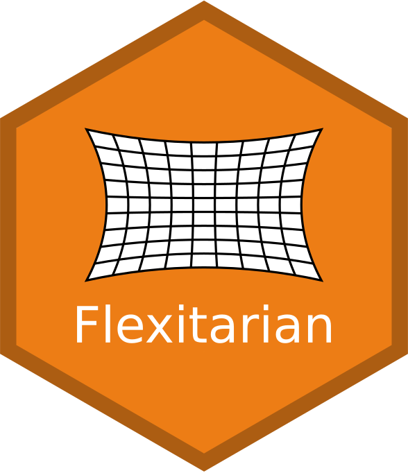

# flexitarian

<!-- badges: start -->
<!-- badges: end -->



For those who want to combine tidyverse with functions that require community data matrices stored in dataframes.

## Installation

You can install flexitarian from GitHub with the devtools package:

``` r
devtools::install_github("fkeck/flexitarian")  
```


## Tibbles to dataframes (and vice versa)


## Example

``` r
library(flexitarian)
x <- data.frame(matrix(rpois(100, 10), nrow = 10))
rownames(x) <- paste("Site", 1:10)
colnames(x) <- paste("Species", LETTERS[1:10])
x
x_tidy <- tidy_cdm(x)
x_tidy
x_df <- spread_cdm(x_tidy, SITE, TAXON, COUNT)
x_df
x_df <- spread_cdm(x_tidy, SITE, TAXON, COUNT, keep.order = TRUE)
all.equal(x, x_df)
```


``` r
x_tidy %>% 
    spread_cdm(SITE, TAXON, COUNT) %>% 
    vegan::diversity() %>% 
    enframe("SITE", "SHANNON_IDX")
```

