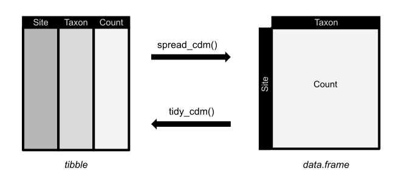

# flexitarian

<!-- badges: start -->
<!-- badges: end -->

For ecologists (and others) who want to combine tidyverse with functions that require classical community data matrix.

## Installation

You can install flexitarian from Github with the devtools package:

``` r
devtools::install_github("fkeck/flexitarian")  
```



## Example

This is a basic example which shows you how to solve a common problem:

``` r
library(flexitarian)

```

